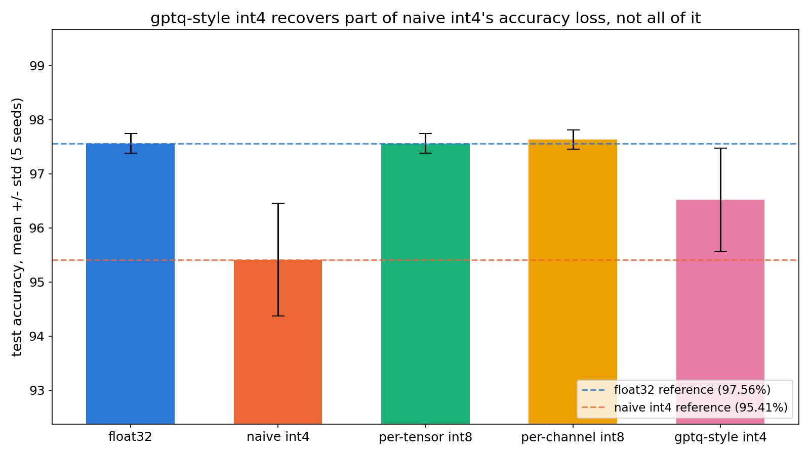

# int4-quantization-recovery

five ways to quantize the same trained network, measured against each other. everything
from scratch in numpy: the mlp, the training loop, and every quantizer including a
gptq-style solver.

## the numbers

a 64 -> 32 -> 32 -> 10 mlp trained on scikit-learn's digits, quantized five ways, scored
on a held-out test split across 5 training seeds (`results/rigor.log`):

| variant | test accuracy (mean +/- std, 5 seeds) | verdict |
|---|---|---|
| float32 | 97.56% +/- 0.18% | reference |
| per-channel int8 | 97.63% +/- 0.18% | free |
| per-tensor int8 | 97.56% +/- 0.18% | free |
| gptq-style int4 | 96.52% +/- 0.95% | most of the loss recovered |
| naive int4 | 95.41% +/- 1.04% | real, repeatable damage |



## reading it

**int8 is free.** per-channel int8 is statistically indistinguishable from float32 —
it scores a hair higher, well inside seed noise.

**int4 is not.** naive round-to-nearest int4 (one per-tensor scale, symmetric, no error
compensation) trails float32 by 0.74 to 4.08 points depending on seed. that is a drop on
every single one of the 5 seeds, not an average washed out by one bad run.

**gptq closes most of the gap, never all of it.** the sequential
quantize-and-compensate scheme beats naive int4 on every seed, by 0.37 to 2.60 points,
and still leaves a 1.04-point residual to float32 on average. that residual is the
mechanism showing through: gptq compensates each layer's own rounding error, but not the
way that error compounds through the layers downstream of it.

**the recovery is seedier than one run would suggest.** one seed's gptq model tied
float32 exactly; another recovered only about a quarter of naive int4's gap. a
single-seed writeup of this project would have told a much cleaner story than the data
supports.

## implementation notes

the gptq-style quantizer follows the obq/gptq line of work but inverts the per-layer
hessian directly instead of using gptq's cholesky trick, which is tractable at this
weight-matrix size and easier to read. no autograd framework anywhere — the mlp's
forward pass, loss and backward pass are all hand-written.

short writeup in `results/FINDING.md`; full numbers in `results/baseline.log`,
`results/run.log`, `results/rigor.log`.

## reproduce

```
python3 -m venv .venv && source .venv/bin/activate
pip install -r requirements.txt
python src/train.py            # trains the float32 model, prints baseline + naive-int4 accuracy -> results/baseline.log
python src/experiment.py       # single-seed evaluation of all five variants -> results/run.log
python src/rigor.py            # 5-seed evaluation, leakage check -> results/rigor.log
python src/plot_headline.py    # regenerates results/headline.png from results/rigor.log
pytest tests/
```
